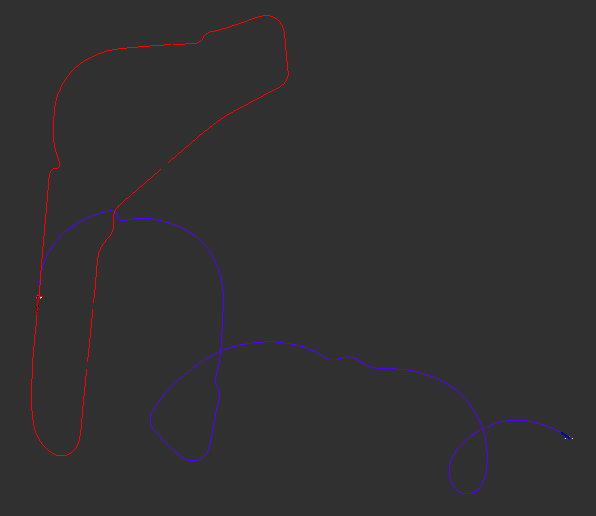

# First Project: Vehicle Pose Estimation and Sector Analysis on Monza Circuit

## Overview

This ROS1-based project (written in C++) analyzes the motion of a vehicle around the Monza racing circuit using data extracted from a bag file (provided by the professors). The project is structured around three ROS nodes that process GPS data, steering angles, and velocity readings to estimate the vehicle's pose and performance in different sectors of the track.

## Node Descriptions

### 🚗 odometer.cpp

This node estimates the pose of the vehicle using a simplified bicycle model based on the steering angle and velocity inputs. The pose is computed by integrating the vehicle's motion over time using the bicycle kinematics equations.

- **Inputs**: Steering angle and velocity (subscribed from ROS topics).
- **Model**: A fixed-parameter bicycle model with configurable parameters for wheelbase and steering factor.
- **Pose Estimation**: Calculates position updates using the current speed and angular change derived from steering. Orientation is handled with quaternions.
- **Features**:
  - Publishes `nav_msgs/Odometry` messages with custom covariance values.
  - Broadcasts TF transformations for RViz.
  - Publishes a `nav_msgs/Path` for debugging (optional).
  - Applies a basic smoothing filter to reduce noise in steering inputs.

### 🌍 gps_odometer.cpp

This node provides a more accurate estimate of the vehicle pose based on GPS data (latitude and longitude).

- **Inputs**: Latitude and longitude from a GPS topic.
- **Conversion**: Converts GPS data to ECEF coordinates, then translates them into a local reference frame (in meters).
- **Pose Estimation**: Calculates heading by comparing positions from two consecutive GPS points.
- **Advantages**: Offers higher precision than the bicycle model but is sensitive to GPS dropouts, which are handled by discarding inconsistent data.
- **Outputs**: Publishes odometry messages and TF transforms.

### ⏱️ sector_times.cpp

This node analyzes the vehicle's timing through different sectors of the track.

- **Inputs**: Latitude, longitude, and velocity.
- **Functionality**:
  - Determines sector transitions using fixed GPS coordinates for each sector.
  - Calculates time spent in each sector and computes average velocity.
  - Sector order is cyclic (1 → 2 → 3 → 1) as the vehicle does not start directly at the first sector.
  - Syncs data based on the slower of the two input frequencies.
- **Outputs**: Publishes a custom message type (`secotor_times.msg`) with sector number, time, and average speed.

## 🖼️ RViz Configuration

Two configuration files are provided in the `rviz/` directory:

- `odom_config.rviz`: Displays the standard TF and odometry topics.
- `odom_config_with_path.rviz`: Includes additional path visualization.

## 🚀 Launch Instructions

Use the provided launch file to start the system:

```bash
roslaunch first_project launch.launch
```

- Launches all three nodes.
- Opens RViz with the basic configuration.
- Initializes parameters (e.g., initial GPS point).
- Includes an optional commented line to switch RViz to the path-enabled version.

## 🧾 Custom Messages

- Custom message defined in `msg/secotor_times.msg`.
- Used to publish structured data on sector performance.

## 🛠️ Build Instructions

Ensure the following ROS dependencies are installed:

- `geometry_msgs`, `nav_msgs`, `sensor_msgs`, `tf`, `std_msgs`

Then build the workspace:

```bash
cd ~/catkin_ws
catkin_make
source devel/setup.bash
```

## 🌐 ROS Network

The ROS network structure, visualized through `rqt_graph`, reveals the flow of data and the interaction between nodes and topics.


### Data Node:
- `/play_1745433034833092095`: This node is playing back data from the project rosbag file, this file contains three topics where the developed nodes get subscribed.

### Published Topics:
- `/swiftnav/front/gps_pose`: This topic contains GPS position data for the front wheels of the vehicle with a frequency around to 10 Hz.
- `/speedsteer`: Represents speed and steering commands from the vehicle published into the network with a 20 Hz frequency.
- `/gps_odom`: Publishes GPS-based odometry data everytime a new GPS data is received.
- `/odom`: Provides vehicle odometry data everytime a new `/speedsteer` data is received.
- `/sector_times`: Publishes the sector in which the vehicle is located along with the time that the vehicle has been in that section, this is done at the same rate of the `/swiftnav/front/gps_pose` topic.
- `/path`: Additional topic created for visualization purposes to employ `path` tool within rviz to review the path of the vehicle according to the Ackerman Model Odometry.
- `/gps_path`: Additional topic created for visualization purposes to employ `path` tool within rviz to review the path of the vehicle according to the GPS Odometry.


## 🔄 TF Tree Description

The TF tree, obtained using `rqt_tf_tree`, describes the transformation hierarchy between coordinate frames, it represents the two independent localization odometry poses used during this project, employing GPS, and the Ackerman Model.


As seen in the figure,

- The `world` frame is the root of the TF tree, and indeed the reference frame.
- Two transforms are being broadcasted, representing independently the localization of the vehicle:
  - From `world` to `odom-gps` by `/gps_odometer`.
  - From `world` to `odom-vehicle` by `/odometer`.


## 📝 Findings and Future Work

Despite occasional signal loss throughout the track due to structures like bridges, GPS-based odometry was found to be a more reliable method for estimating the vehicle's position. In this way, the consistency and accuracy under open-sky conditions outperformed the ackerman odometry approach, especially when navigating long straight sections where drift in traditional motion models can accumulate significantly.

As future work, the performance of the odometry based on the Ackermann model should be improved. The deviation observed in this method is largely attributed to measurement noise, especially concerning the steering angle. One of the proposed solutions was to define a threshold range within which the steering angle would be set to zero. However, this approach was discarded due to poor performance in wide turns. On the other hand, integrating covariance matrices directly into the ROS messages, was used providing better results but still lacked precision due to limited information about the employed sensor. As a temporary final implementation, a filter was applied where steering angles below 9 degrees were set to zero, and typical covariance values found online were used — specifically, a value of 0.2 for the steering angle — to enhance the system’s stability. Further calibration and sensor characterization are recommended to optimize this solution.

The following figure shows the results obtained, as expected in red the odometry based in GPS data can be found, while in blue the Ackerman Model Odometry can be seen while employing diverse techniques to improve its performance.

| **Odometry without compensation**                   | **Filter Compensation**                 |
|-----------------------------------------------------|-----------------------------------------|
|            |  |
| **Covariance Compensation**                         | **Covariance and Filter Compensation**  |
|       |  |

## 👨‍💻 Authors

This project was developed by **Francesco Lazzaro** and **Andres Felipe Forero Salas** as part of an academic and practical exploration of vehicle localization using ROS.

---

For further customization, dataset substitution, or circuit changes, feel free to fork and adapt this project.
